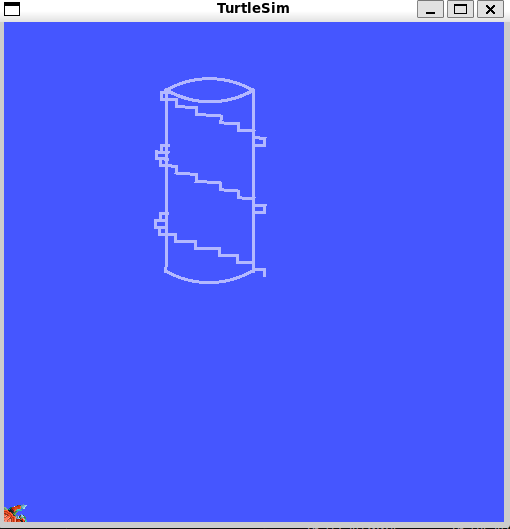
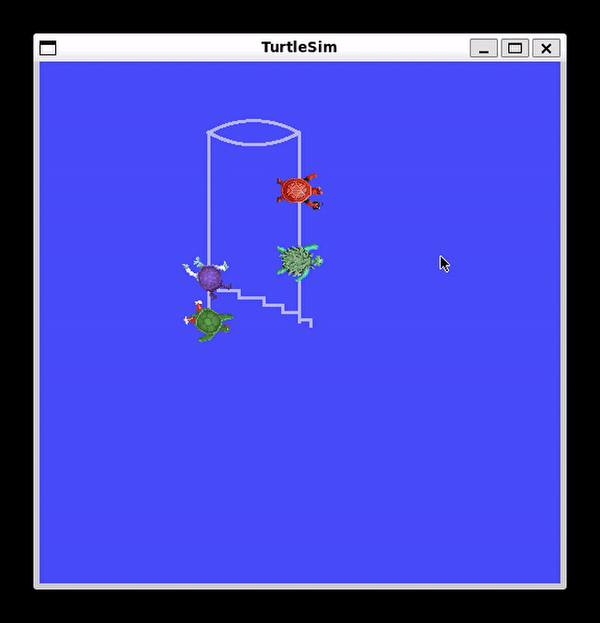
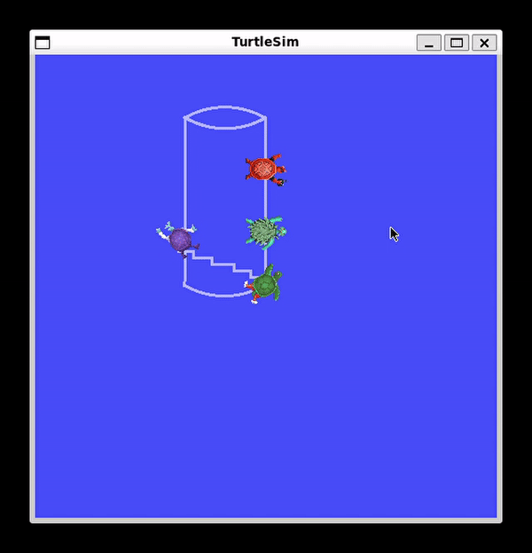
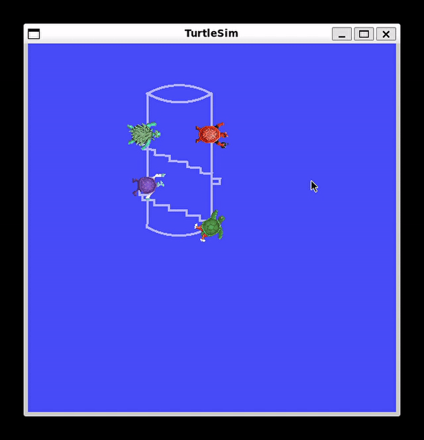
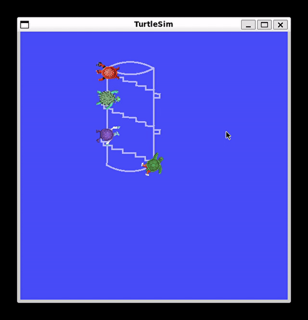

# `con_sbh_project` package
ROS 2 C++ package.  [](https://docs.ros.org/en/humble/)

A package két node-ból áll, a turtlesim szimulátoron belül a `/cylinder_draw` node segítségével egy hengert rajzol az egyik teknős a képernyőre, majd ezután a `/staircase_draw` node egy csigalépcsőt rajzol a henger köré 3 teknős segítségével. Mindegyik node `geometry_msg/twist` típusú topicot hírdet. Megvalósítás `ROS2 Humble` alatt.

This package consists of two nodes. The `/cylinder_draw` node draws a cylinder inside turtlesim, after which the `/staircase_draw` node draws a spiral staircase around the cylinder. Both publish a `geometry_msg/twist` type topic. The package builds in `ROS2 Humble` 

## Packages and build

It is assumed that the workspace is `~/ros2_ws/`.

### Clone the packages
``` r
cd ~/ros2_ws/src
```
``` r
git clone https://github.com/gunter-png/con_sbh_project
```

### Build ROS 2 packages
``` r
cd ~/ros2_ws
```
``` r
colcon build --packages-select con_sbh_project --symlink-install
```

<details>
<summary> Don't forget to source before ROS commands.</summary>

``` bash
source ~/ros2_ws/install/setup.bash
```
</details>

``` 
ros2 launch con_sbh_project launch.py
```
## Image


##

A képet `rqt` segítéségével, a `set_pen` `off`bekapcsolásával (minden teknősnél), valamint a `teleport_absolute ` `x: 0.0`, és `y: 0.0`-hoz való elteleportálásuk segítségével csináltam

The image was made using `rqt`, after turning on `set_pen` `off` (for each turtle), and using `teleport_absolute` with the coordinates being `x: 0.0` and `y: 0.0`.

## Gifs

   

## Graph

The `/cylinder_draw` node publishes a `/turtle1/cmd_vel` topic (type:geometry_msgs/Twist), the `/staircase_draw` node publishes `/turtle2/cmd_vel`, `/turtle3/cmd_vel`
and `/turtle4/cmdl_vel` topics and simulator node (`/sim`) subscribes to all of these topics.

```mermaid
graph LR

cylinder([/cylinder_draw]):::red --> turtle1([/turtle1/cmd_vel<br/>geometry_msgs/Twist]):::light --> sim([/sim]):::light
staircase([/staircase_draw]):::red --> turtle2([/turtle2/cmd_vel<br/>geometry_msgs/Twist]):::light --> sim
staircase --> turtle3([/turtle3/cmd_vel<br/>geometry_msgs/Twist]):::light --> sim
staircase --> turtle4([/turtle4/cmd_vel<br/>geometry_msgs/Twist]):::light --> sim

classDef light fill:#34aec5,stroke:#152742,stroke-width:2px,color:#152742  
classDef dark fill:#152742,stroke:#34aec5,stroke-width:2px,color:#34aec5
classDef white fill:#ffffff,stroke:#152742,stroke-width:2px,color:#152742
classDef red fill:#ef4638,stroke:#152742,stroke-width:2px,color:#fff